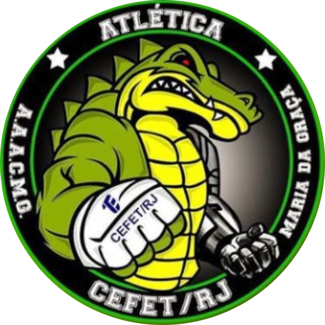
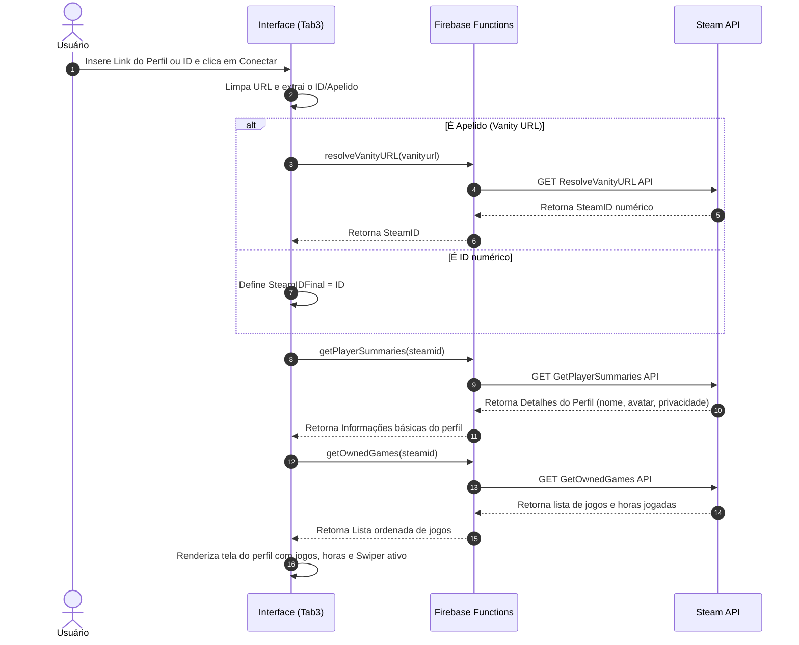

# 🐊 Backlogator

<p align="center">
  
</p>

<p align="center">
  <strong>Transforme sua biblioteca de jogos da Steam em uma competição divertida com os seus amigos.</strong>
</p>

<p align="center">
  
  
  
  
  
  
</p>

---

## 📖 Sobre o Projeto

O **Backlogator** é um aplicativo mobile-first desenvolvido com **Ionic React** e **Capacitor** para o **IEEE (vulgo IES)** da nossa faculdade. O projeto foi projetado para jogadores que querem organizar seus backlogs de jogos, monitorar horas jogadas e compartilhar conquistas em um ambiente gamificado com amigos de forma simples e intuitiva.

O app consome a **Steam Web API** (via Firebase Cloud Functions) para sincronizar bibliotecas de jogos em tempo real e utiliza o **Firebase** como infraestrutura de banco de dados e autenticação segura de usuários.

---

## ✨ Funcionalidades Principais

*   🔐 **Autenticação Segura (Firebase Auth):** Sistema completo de Cadastro, Login com verificação de e-mail e Recuperação de Senha.
*   🛡️ **Proteção Antirobô (Google reCAPTCHA):** Integração com reCAPTCHA v2 para evitar acessos automatizados indesejados.
*   🎮 **Sincronização com a Steam:**
    *   Sincroniza perfil público da Steam usando apenas o link ou SteamID.
    *   Trata perfis privados com avisos informativos elegantes.
    *   Importa e ordena toda a sua biblioteca de jogos com base nas horas jogadas.
*   📊 **Painel de Estatísticas:** Veja o total de jogos da sua biblioteca e a contagem consolidada de horas jogadas no seu perfil.
*   🔍 **Pesquisa e Filtragem Dinâmica:** Filtre jogos da biblioteca por categoria, gênero ou nome em tempo real.
*   📱 **Design Premium Mobile-First:** Interface inspirada nos consoles modernos, com Dark Mode nativo, componentes deslizantes (Swiper.js) e transições suaves.

---

## 🏗️ Arquitetura do Sistema

O Backlogator adota uma arquitetura descentralizada orientada a serviços e serverless, dividida em três camadas principais:

1. **Frontend (Camada de Apresentação):** SPA desenvolvida em **Ionic React** e **Capacitor** para entrega mobile-first responsiva.
2. **Backend (Camada de Serviços & Funções):** Infraestrutura baseada em nuvem gerenciada via **Firebase**, utilizando **Authentication**, **Realtime Database** e **Cloud Functions** (servindo como camada de microsserviços/API Gateway).
3. **Integrações Externas:** Comunicação direta/indireta com a **Steam Web API** e **Google reCAPTCHA API**.

### Diagrama de Arquitetura de Referência

```mermaid
graph TD
    subgraph Cliente (Mobile / Web)
        A[Ionic React App] -->|Autenticação| B[Firebase Auth]
        A -->|Eventos e Ranking| C[Firebase Realtime Database]
        A -->|Chamadas HTTPS Callables| D[Firebase Cloud Functions]
        A -->|Dados de Jogos / CORS Proxy| E[Steam Web Store API]
    end

    subgraph Backend Serverless (Firebase)
        D -->|Requisições Seguras com API Key| F[Steam Web API]
    end

    subgraph APIs Externas
        E
        F
    end
```

### Fluxo de Integração e Carregamento de Jogos



---

## 🛠️ Tecnologias e Stack Tecnológica

| Componente | Tecnologia | Papel no Projeto |
| :--- | :--- | :--- |
| **Apresentação** | Ionic React (v8) / React (v19) | Interface baseada em componentes web nativos otimizados para gestos e dispositivos móveis. |
| **Roteamento** | React Router Dom (v5) | Gerenciamento de rotas declarativas e navegação por abas (Tabs). |
| **Gerenciamento de Build** | Vite (v8) | Compilação e empacotamento rápido (HMR instantâneo, utilizando Rolldown sob o capô). |
| **Banco de Dados** | Firebase Realtime Database | Persistência ágil em tempo real e controle de dados de perfil sincronizados. |
| **Autenticação** | Firebase Authentication | Fluxo seguro de autenticação (OAuth, e-mail/senha), redefinição de senhas e verificação de e-mails. |
| **API Gateway (Proxy)** | Firebase Cloud Functions (v2) | Microsserviços serverless seguros para ocultar chaves de API restritas e tratar requisições de backend. |
| **Segurança** | Google reCAPTCHA v2 | Prevenção de abusos cibernéticos e acessos automatizados (bots) na tela de cadastro. |
| **Testes** | Vitest / Cypress | Testes unitários de regras de negócio e testes automatizados de interface de ponta a ponta (E2E). |

---

## 🧠 Decisões de Design e Engenharia

### Abstração e Segurança da Steam Web API (Cloud Functions)
* **Problema:** A Steam Web API exige uma chave privada (`STEAM_API_KEY`). Fazer chamadas diretas a partir do cliente exporia esta chave pública no bundle JavaScript do navegador, permitindo clonagem e abusos de cota. Fazer requisições diretas do navegador também gerava problemas de CORS.
* **Solução:** Implementação de um Proxy Backend Serverless utilizando **Firebase Cloud Functions (v2)** em TypeScript. O cliente executa funções tipadas via `httpsCallable`. As funções em execução segura na nuvem Firebase injetam a chave de API de forma invisível via variáveis de ambiente privadas, fazem o fetch para a Steam API e retornam os dados tratados ao cliente.

### Sincronização por Link de Perfil (Resolução de Vanity URL)
* **Problema:** Usuários geralmente não sabem seu ID numérico de 17 dígitos da Steam (`SteamID64`), sabendo apenas o link personalizado do seu perfil (ex: `https://steamcommunity.com/id/nome_personalizado`).
* **Solução:** Pipeline inteligente no backend:
  1. O cliente envia o texto inputado pelo usuário.
  2. O sistema higieniza a string. Se for numérica, assume como ID bruto.
  3. Se contiver texto, invoca a função `resolveVanityURL` que consulta o endpoint correspondente da Steam para decodificar o apelido em um ID numérico único.
  4. Com o ID resolvido, chama-se os serviços subsequentes (`getPlayerSummaries`, `getOwnedGames`) para puxar o perfil e a lista de jogos do jogador.

### Estrutura de Autenticação Segura (Context Pattern)
A arquitetura do React utiliza o padrão de **Context Provider** (`AuthContext`) que encapsula o estado de autenticação do Firebase. Isso garante:
* Acesso facilitado ao estado global de autenticação em qualquer página do app via Hook customizado `useAuth()`.
* Tratamento unificado de erros, envio de e-mails de validação no momento do registro e fluxos seguros de redefinição de senhas.

---

## 🔒 Segurança e Estrutura de Dados

### Estrutura dos Dados no Firebase Realtime Database
Para manter o perfil social atualizado de forma otimizada para o ranking de amigos e sincronização instantânea:

```json
{
  "BancoDeDados": {
    "UIDs": {
      "USER_FIREBASE_UID_123": {
        "nomeUsuario": "Nome do Jogador",
        "tempoTotal": 1450,
        "dataCadastro": "2026-07-14"
      }
    }
  }
}
```

### Práticas de Segurança Implementadas
1. **CORS Proxying:** Utilização do `corsproxy.io` para requisições de leitura de metadados públicos e imagens de jogos da loja da Steam que não requerem autenticação por chave privada, evitando problemas de restrição do navegador.
2. **Firebase Security Rules:** Configuração de regras granulares para o banco de dados que validam se o usuário autenticado está modificando apenas seus próprios registros de pontuações de jogos ou perfil.
3. **reCAPTCHA v2 Verification:** Impedimento de ataques automatizados de força bruta por robôs e automatizadores para criação de contas falsas no ecossistema do aplicativo.
4. **Proteção de Chaves de API:** Isolamento absoluto de credenciais sensíveis (como `STEAM_API_KEY`) que ficam armazenadas apenas nas variáveis de ambiente seguras do Firebase Functions.

---

## 🚀 Instalação e Execução Local

Siga as etapas abaixo para configurar e executar o projeto em sua máquina:

### 1. Pré-requisitos
* [Node.js](https://nodejs.org/) (Recomendado versão 20 ou superior LTS)
* Gerenciador de pacotes `npm`

### 2. Clonar e Instalar Dependências
No seu terminal favorito, navegue até a pasta do projeto e instale as dependências:
```bash
# Entre na pasta do projeto
cd IES-Projeto-Dados

# Instale os pacotes
npm install
```
> [!TIP]
> No Windows, se você estiver usando o terminal **PowerShell** e encontrar erros de política de execução, você pode habilitar a execução de scripts locais com:
> `Set-ExecutionPolicy -ExecutionPolicy RemoteSigned -Scope CurrentUser`
> Ou opte por executar usando o sufixo `.cmd` (ex: `npm.cmd install`).

### 3. Conexão Automática e Simplificada
Para rodar e testar o aplicativo localmente, **não é necessária nenhuma configuração manual complexa de chaves do Firebase ou chaves de API da Steam**. 

O projeto já está integrado diretamente com o banco de dados do Firebase. Para carregar seus jogos e conquistas no app, basta inserir o **link direto do seu perfil público da Steam** (ou o seu SteamID) na tela de perfil e seus dados aparecerão instantaneamente!

### 4. Executar Servidor de Desenvolvimento
Inicie o servidor local do Vite para testar no navegador:
```bash
npm run dev
```
*(ou `npm.cmd run dev` se estiver no PowerShell sem permissão de scripts).*

O terminal exibirá um endereço local semelhante a:
👉 `http://localhost:5173/`

---

## 📁 Estrutura de Pastas

```text
IES-Projeto-Dados/
├── .vscode/               # Configurações do VS Code
├── cypress/               # Testes ponta a ponta (E2E)
├── functions/             # Funções de backend (Firebase Cloud Functions)
├── public/                # Recursos estáticos públicos
├── resources/             # Imagens e logotipos do app
├── src/
│   ├── components/        # Componentes globais reutilizáveis
│   ├── contexts/          # Provedores de contexto React (ex: AuthContext)
│   ├── hooks/             # Custom Hooks da aplicação
│   ├── pages/             # Telas do aplicativo (Home, Login, Tabs...)
│   ├── theme/             # Variáveis globais de estilo e cores do Ionic
│   ├── App.tsx            # Roteamento e estrutura principal
│   └── firebase.ts        # Arquivo de inicialização do Firebase
├── tsconfig.json          # Configurações do compilador TypeScript
└── vite.config.ts         # Configurações do Vite
```

## 🧪 Execução e Desenvolvimento

O principal comando utilizado no projeto é:

* `npm run dev`: Executa o servidor de desenvolvimento Vite local (`http://localhost:5173/`).

---

<p align="center">
  Desenvolvido com 💚 para o **IEEE (vulgo IES)** de nossa faculdade.
</p>
